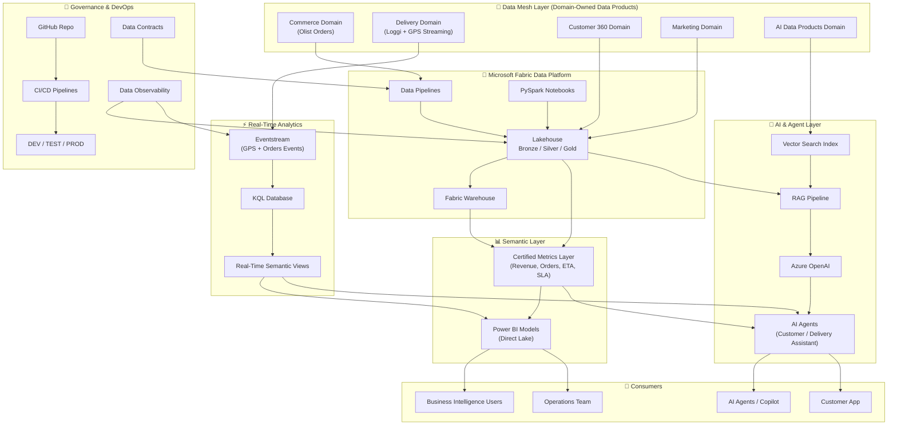

# Enterprise Data & AI Platform on Microsoft Fabric

## Vision

This project demonstrates a modern **Enterprise Data & AI Platform** built on **Microsoft Fabric**, combining:

- Data Engineering
- Analytics Engineering
- Real-Time Streaming Analytics
- AI Agents & Generative AI
- Data Mesh Architecture
- Data Governance & Contracts
- DevOps & CI/CD

The goal is to simulate a **real-world, production-grade data ecosystem** capable of supporting operational analytics, real-time decision-making, and AI-driven experiences.

---

## Business Problem

Modern enterprises struggle with:

- Fragmented data across multiple systems
- Lack of real-time visibility into operations
- Inconsistent KPIs across business units
- Slow decision-making due to batch-only analytics
- No AI layer connected to trusted enterprise data

This project simulates a **Delivery & E-commerce company** where:

- Customers place orders (Commerce domain)
- Orders are fulfilled and delivered (Delivery domain)
- Fleet movements generate real-time events
- Business requires instant insights and AI-driven answers

---

## Solution Overview

This platform implements a **Data Mesh + Medallion + Real-Time + AI architecture** using Microsoft Fabric.

### Core Concepts

- **Data Mesh:** Domain-oriented data ownership (Commerce, Delivery, Customer, Marketing, AI)
- **Medallion Architecture:** Bronze → Silver → Gold data layers
- **Real-Time Analytics:** Event-driven GPS tracking and delivery monitoring
- **Semantic Layer:** Unified business metrics (Revenue, Orders, ETA, SLA)
- **AI Layer:** Intelligent agents powered by Azure OpenAI and Fabric Data Agents
- **Governance:** Data contracts, validation, and observability
- **DevOps:** CI/CD pipelines using GitHub integration

---
### Data Sources
This platform is built using publicly available datasets from Kaggle and synthetic generated data to simulate real enterprise operations.


Core datasets include:

- Olist E-commerce Dataset (Commerce Domain)
  - Source: Kaggle – Brazilian E-Commerce Public Dataset by Olist
  - Provides orders, customers, products, payments, and reviews.

- LoggiBUD Delivery Dataset (Delivery Domain)
  - Source: Kaggle – Loggi Benchmark for Urban Deliveries (LoggiBUD)
  - Provides delivery routes, drivers, and logistics performance data.

---

---

## Architecture Diagram

---

## Technology Stack

### Microsoft Fabric
- Lakehouse
- Data Pipelines
- Notebooks (PySpark)
- Warehouse
- Eventstream
- KQL Database
- Power BI

### AI & GenAI
- Azure OpenAI
- Fabric Data Agents
- RAG (Retrieval-Augmented Generation)
- Vector Search

### Data Engineering
- PySpark
- SQL Analytics
- Delta Lake

### DevOps
- GitHub
- CI/CD Pipelines
- Deployment Environments (Dev / Test / Prod)

### Governance
- Data Contracts
- Schema Validation
- Data Quality Monitoring
- Observability Framework

---

## Key Capabilities

### 🔹 Data Engineering
- Batch ingestion using Medallion architecture
- Scalable Lakehouse design
- Data transformations using PySpark

### 🔹 Real-Time Analytics
- Live GPS tracking simulation
- Event-driven architecture using Eventstream
- KQL-based real-time queries

### 🔹 Analytics & BI
- Semantic model with certified KPIs
- Direct Lake Power BI integration
- Role-based access control (RLS / OLS)

### 🔹 AI Agents
- Natural language query over enterprise data
- Delivery ETA prediction
- Context-aware customer support assistant

### 🔹 Data Mesh
- Domain-based ownership
- Data products per business domain
- Federated governance model

### 🔹 Data Governance
- Data contracts enforcement
- Schema drift detection
- Data quality monitoring and alerts

### 🔹 DevOps
- CI/CD pipelines across environments
- Version-controlled data assets
- Automated deployment workflows

---

## Project Structure

```bash
enterprise-data-ai-platform/
│
├── README.md
│
├── docs/
│   ├── 00-business-case/
│   ├── 01-enterprise-architecture/
│   ├── 02-data-platform/
│   ├── 03-analytics-platform/
│   ├── 04-real-time-analytics/
│   ├── 05-ai-agents-platform/
│   ├── 06-data-contracts-observability/
│   ├── 07-semantic-layer/
│   ├── 08-devops-cicd/
│   └── 09-governance-security/
│
├── notebooks/
├── pipelines/
├── sql/
├── datasets/
├── diagrams/
└── images/
```


---

## Explore the Solution

This project is structured as a modular enterprise platform.

### 📊 Data & Platform
- Data ingestion and Medallion architecture
- Lakehouse and transformation pipelines

### 📈 Analytics & BI
- Semantic models and KPI definitions
- Power BI dashboards with Direct Lake

### ⚡ Real-Time Analytics
- Live fleet tracking system
- Event-driven delivery monitoring

### 🤖 AI Platform
- Intelligent delivery assistant
- Natural language querying over enterprise data

### 🔐 Data Governance
- Data contracts enforcement
- Observability and monitoring framework

### 🧠 Semantic Layer
- Certified business metrics
- Single source of truth across all consumers

### 🚀 DevOps
- CI/CD pipelines
- Multi-environment deployment strategy

---

## Final Note

This project is designed as a **production-grade reference architecture**, showcasing how modern enterprises can unify:

- Data Engineering
- Real-Time Systems
- AI Agents
- Data Governance
- DevOps

into a single **AI-native data platform built on Microsoft Fabric**.