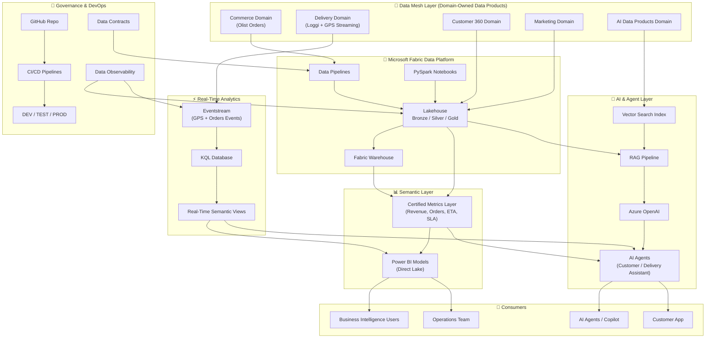

# 🏗️ Enterprise Architecture

This document describes the end-to-end architecture of the **Enterprise Data & AI Platform on Microsoft Fabric**, including data flows, domain design, real-time processing, AI integration, and governance.

---

# 🧭 1. Architecture Overview

The platform is designed as a unified **Data Mesh + Medallion + Real-Time + AI architecture**.

It integrates:

- Domain-oriented data ownership (Data Mesh)
- Lakehouse-based data processing (Medallion)
- Real-time streaming analytics
- Semantic business layer
- AI agents powered by enterprise data
- End-to-end governance and DevOps

---

# 🧱 2. High-Level Architecture

---

## 🧭 3. Architecture Layers Explained

### 🏢 Data Mesh Layer

Domain-oriented architecture where each business unit owns its data products:

- Commerce (orders, payments, customers)
- Delivery (fleet, routes, tracking)
- Customer (360 view)
- Marketing (campaigns, analytics)
- AI Data Products (embeddings, features)

---

### 🧱 Data Platform (Microsoft Fabric)

Core processing engine of the system:

- Data ingestion via pipelines  
- Lakehouse storage (Bronze / Silver / Gold)  
- Data Warehouse for structured analytics  
- PySpark transformations  

---

### ⚡ Real-Time Layer

Handles live operational data:

- Eventstream ingestion (GPS, orders)  
- KQL database for streaming queries  
- Real-time views for operational dashboards  

---

### 📊 Semantic Layer

Business-friendly abstraction layer:

- Certified KPIs (Revenue, ETA, SLA)  
- Single source of truth  
- Power BI Direct Lake models  

---

### 🤖 AI Layer

Intelligent reasoning layer:

- RAG pipeline over enterprise data  
- Vector search index  
- Azure OpenAI for reasoning  
- AI agents for operations and customer interaction  

---

### 🚀 Governance & DevOps

Enterprise control layer:

- Data contracts per domain  
- CI/CD pipelines (GitHub integration)  
- Multi-environment deployment (Dev/Test/Prod)  
- Observability and data quality monitoring  

---

## 🧰 4. Technology Stack

### 🧱 Microsoft Fabric
- Lakehouse  
- Data Pipelines  
- Warehouse  
- Eventstream  
- KQL Database  
- Power BI  

---

### 🤖 AI & GenAI
- Azure OpenAI  
- RAG architecture  
- Vector Search  
- AI Agents  

---

### ⚙️ Data Engineering
- PySpark  
- SQL Analytics  
- Delta Lake  

---

### 🚀 DevOps
- GitHub  
- CI/CD pipelines  
- Multi-environment deployments  

---

### 🔐 Governance
- Data Contracts  
- Data Quality Rules  
- Observability Framework  

---

## 🧠 5. Design Principles

This architecture follows:

- **Data Mesh**: decentralized domain ownership  
- **Medallion Architecture**: structured data refinement  
- **Event-driven design**: real-time responsiveness  
- **AI-native architecture**: intelligence embedded in data flows  
- **Governed data platform**: trust and quality by design  

---

## 🎯 6. Outcome

This architecture enables:

- Real-time operational intelligence  
- Scalable enterprise analytics  
- AI-powered decision systems  
- Unified business metrics layer  
- Governed and reliable data ecosystem  

---

