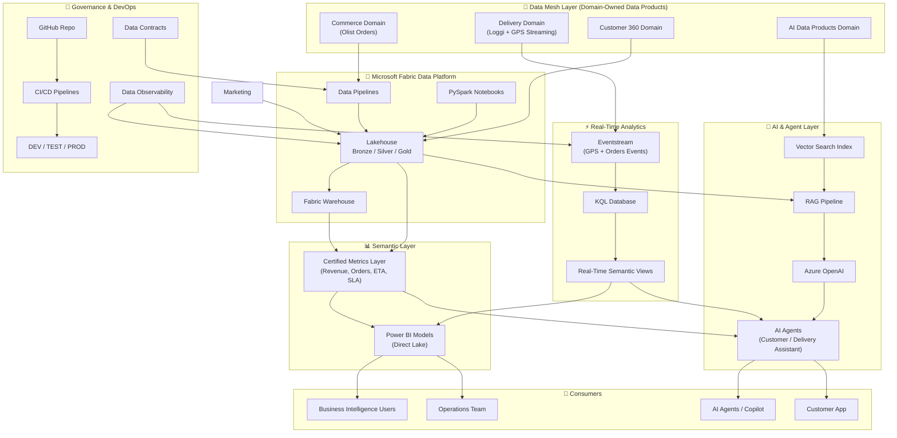

# 🏗️ Enterprise Architecture

This document describes the end-to-end architecture of the **Enterprise Data, AI & Decision Intelligence Platform on Microsoft Fabric**.

The architecture integrates modern data engineering, real-time analytics, artificial intelligence, governance, enterprise planning, and DevOps into a single governed platform following Microsoft Fabric best practices.

---

# 🎯 Architecture Vision

The platform is designed following modern enterprise architecture principles where trusted data becomes a strategic asset for analytics, artificial intelligence, and business planning.

Rather than implementing isolated technologies, the solution combines domain-oriented ownership, governed data products, semantic models, real-time analytics, AI Agents, and Decision Intelligence into a unified Microsoft Fabric ecosystem.

---

# 🧭 1. Architecture Overview

The platform is designed as a unified enterprise architecture combining:

- Data Mesh
- Medallion Architecture
- Lakehouse Architecture
- Real-Time Analytics
- Semantic Modeling
- Artificial Intelligence
- Decision Intelligence
- Enterprise Planning (Fabric IQ Ready)
- Enterprise Governance
- DevOps & CI/CD

---

# 🧱 2. High-Level Architecture

```mermaid
flowchart TB

%% =========================
%% USERS / CONSUMERS
%% =========================
subgraph Users["👥 Consumers"]
    CustomerApp["Customer App"]
    OpsTeam["Operations Team"]
    BIUsers["Business Intelligence Users"]
    AIUsers["AI Agents / Copilot"]
end

%% =========================
%% DATA MESH LAYER
%% =========================
subgraph Mesh["🏢 Data Mesh Layer (Domain-Owned Data Products)"]

    Commerce["Commerce Domain\n(Olist Orders)"]
    Delivery["Delivery Domain\n(Loggi + GPS Streaming)"]
    Customer["Customer 360 Domain"]
    AIDomain["AI Data Products Domain"]
end

%% =========================
%% INGESTION / PROCESSING
%% =========================
subgraph Fabric["🧱 Microsoft Fabric Data Platform"]

    Ingestion["Data Pipelines"]
    Lakehouse["Lakehouse\nBronze / Silver / Gold"]
    Warehouse["Fabric Warehouse"]
    Notebooks["PySpark Notebooks"]
end

%% =========================
%% REAL-TIME LAYER
%% =========================
subgraph Realtime["⚡ Real-Time Analytics"]

    Eventstream["Eventstream\n(GPS + Orders Events)"]
    KQL["KQL Database"]
    RealtimeViews["Real-Time Semantic Views"]
end

%% =========================
%% SEMANTIC LAYER
%% =========================
subgraph Semantic["📊 Semantic Layer"]

    Metrics["Certified Metrics Layer\n(Revenue, Orders, ETA, SLA)"]
    PowerBI["Power BI Models\n(Direct Lake)"]
end

%% =========================
%% AI LAYER
%% =========================
subgraph AI["🤖 AI & Agent Layer"]

    Agents["AI Agents\n(Customer / Delivery Assistant)"]
    RAG["RAG Pipeline"]
    VectorDB["Vector Search Index"]
    OpenAI["Azure OpenAI"]
end

%% =========================
%% GOVERNANCE / DEVOPS
%% =========================
subgraph Platform["🚀 Governance & DevOps"]

    GitHub["GitHub Repo"]
    CI["CI/CD Pipelines"]
    Envs["DEV / TEST / PROD"]
    Contracts["Data Contracts"]
    Observability["Data Observability"]
end

%% =========================
%% DATA MESH FLOWS
%% =========================
Commerce --> Ingestion
Delivery --> Eventstream
Customer --> Lakehouse
Marketing --> Lakehouse
AIDomain --> VectorDB

%% =========================
%% FABRIC FLOWS
%% =========================
Ingestion --> Lakehouse
Lakehouse --> Warehouse
Notebooks --> Lakehouse

%% =========================
%% REAL-TIME FLOWS
%% =========================
Eventstream --> KQL
KQL --> RealtimeViews
RealtimeViews --> PowerBI

%% =========================
%% SEMANTIC FLOWS
%% =========================
Warehouse --> Metrics
Lakehouse --> Metrics
Metrics --> PowerBI

%% =========================
%% AI FLOWS
%% =========================
Lakehouse --> RAG
VectorDB --> RAG
RAG --> OpenAI
OpenAI --> Agents
Metrics --> Agents
RealtimeViews --> Agents

%% =========================
%% CONSUMPTION LAYER
%% =========================
PowerBI --> BIUsers
Agents --> AIUsers
Agents --> CustomerApp
PowerBI --> OpsTeam

%% =========================
%% DEVOPS FLOWS
%% =========================
GitHub --> CI
CI --> Envs

Contracts --> Ingestion
Observability --> Lakehouse
Observability --> Eventstream

```
---

## 🧭 3. Architecture Layers Explained

### 🏢 Data Mesh Layer

Domain-oriented architecture where each business unit owns its data products:

- Commerce (orders, payments, customers)
- Delivery (fleet, routes, tracking)
- Customer (360 view)
- AI Plastform (embeddings, features)

---

## 🧱 Data Platform (Microsoft Fabric)

The core enterprise data platform responsible for ingesting, storing, transforming, and serving enterprise data.

Main capabilities:

- Data Pipelines
- OneLake
- Lakehouse
- Bronze / Silver / Gold architecture
- Fabric Warehouse
- PySpark Notebooks
- Delta Lake

---

## ⚡ Real-Time Analytics Layer

Provides operational intelligence through event-driven architectures.

Capabilities include:

- Eventstream
- KQL Database
- Live GPS events
- Streaming analytics
- Operational dashboards
- Real-time monitoring

---

## 📊 Semantic Layer

Business abstraction layer providing consistent business definitions across all consumers.

Capabilities:

- Certified KPIs
- Semantic Models
- Direct Lake
- DirectQuery
- Shared Business Metrics
- Single Version of the Truth

---

## 🤖 AI & Decision Intelligence Layer

This layer enables intelligent interaction with enterprise data through AI agents, Retrieval-Augmented Generation (RAG), and Azure OpenAI.

Beyond conversational AI, it supports decision intelligence by combining semantic models, trusted enterprise data, and real-time operational events.

Capabilities include:

- Azure OpenAI
- Fabric Data Agents
- AI Agents
- RAG Pipelines
- Vector Search
- Natural Language Analytics
- Decision Support

---

## 📈 Enterprise Planning Layer (Fabric IQ Ready)

The architecture is intentionally designed to support future enterprise planning capabilities.

Although Microsoft Fabric Planning (Fabric IQ) is not implemented in this project, the platform is prepared to support:

- Budgeting
- Forecasting
- Scenario Analysis
- Executive Scorecards
- AI-assisted Planning
- Decision Intelligence

This allows operational analytics, AI, and business planning to share the same trusted semantic foundation.

---

## 🚀 Governance & DevOps Layer

Enterprise control layer ensuring secure, governed, and repeatable deployments.

Capabilities include:

- Data Contracts
- Data Quality
- Data Observability
- GitHub Integration
- CI/CD Pipelines
- Deployment Pipelines
- DEV / TEST / PROD environments

---

# 🧰 4. Technology Stack

## 🧱 Microsoft Fabric

- OneLake
- Lakehouse
- Data Pipelines
- Dataflow Gen2
- Warehouse
- Eventstream
- KQL Database
- Semantic Models
- Power BI
- Deployment Pipelines

---

## ☁️ Microsoft Azure

- Azure Data Lake Storage Gen2
- Azure OpenAI

---

## 💻 Programming Languages

- Python
- PySpark
- SQL

---

## 🤖 Artificial Intelligence

- Azure OpenAI
- Fabric Data Agents
- Retrieval-Augmented Generation (RAG)
- Vector Search

---

## 🔐 Governance

- Data Mesh
- Data Contracts
- Data Observability
- Data Quality

---

## 🚀 DevOps

- Git
- GitHub
- CI/CD
- Deployment Pipelines

---

# 🏛️ 5. Enterprise Design Principles

The architecture follows modern enterprise architecture principles:

- Domain-Oriented Ownership (Data Mesh)
- Data as a Product
- Medallion Architecture
- Lakehouse-first Design
- Semantic-first Consumption
- AI-ready Data Platform
- Real-Time by Design
- Governance by Default
- Infrastructure & Analytics as Code
- Enterprise Planning Ready

---

# 🎯 6. Expected Outcome

The resulting architecture enables:

- Trusted enterprise data products
- Unified semantic models
- Real-time operational intelligence
- AI-powered enterprise assistants
- Decision Intelligence
- Enterprise Planning readiness
- Governed self-service analytics
- Scalable cloud-native architecture

The platform demonstrates how Microsoft Fabric can unify data engineering, analytics engineering, real-time analytics, artificial intelligence, governance, DevOps, and enterprise planning within a single modern enterprise platform.

---

