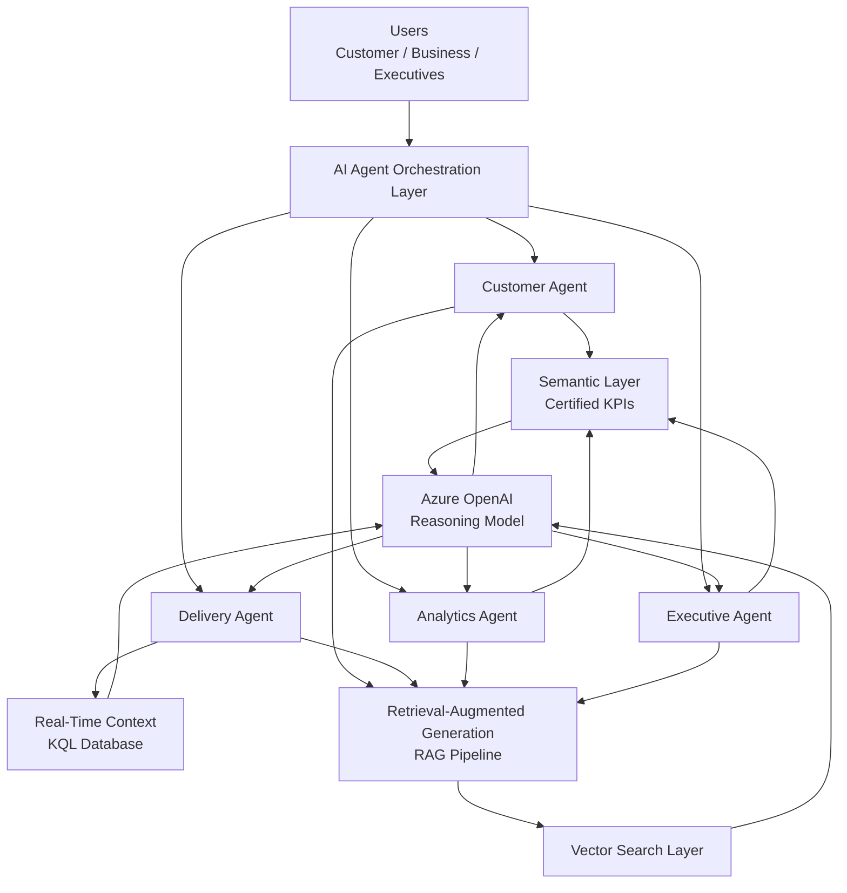

# 🤖 05 - AI & Decision Intelligence Platform
## Intelligent Reasoning Layer on Microsoft Fabric + Azure OpenAI

---

# 🧭 1. Overview

The **AI & Decision Intelligence Platform** is the intelligence reasoning layer of the enterprise architecture.

It represents the reasoning capability built on top of trusted enterprise data, semantic definitions, and real-time operational context.

Its purpose is to transform trusted enterprise data into intelligent business experiences by combining:

- Certified semantic models
- Enterprise data products
- Real-time operational context
- Retrieval-Augmented Generation (RAG)
- Vector Search capabilities
- Azure OpenAI reasoning models
- AI Agents specialized by business domain

This layer enables the evolution from a traditional analytics platform into an:

> **AI-native, real-time, enterprise decision intelligence platform**

The platform does not replace analytical systems.

Instead, it consumes governed business information and provides intelligent reasoning capabilities on top of trusted enterprise data.

---

# 🏗️ 2. Position in Enterprise Architecture

The **AI & Decision Intelligence Platform** is the intelligence consumption layer of the enterprise architecture.

It represents the final reasoning capability built on top of trusted enterprise data and business definitions.

The AI layer does not replace the Data Platform or Analytics Platform.

Instead, it consumes certified information produced by previous layers and adds:

- Natural language interaction
- AI reasoning
- Business interpretation
- Decision support capabilities

The architecture flow is:

```text
Source Systems
       |
       v
Data Platform
(Bronze / Silver / Gold)
       |
       v
Analytics Platform
(Semantic Models + Certified KPIs)
       |
       v
AI & Decision Intelligence Platform
(AI Agents + RAG + Azure OpenAI)
       |
       v
Business Consumers
(Customers / Operations / Executives)
```


The AI layer never queries raw operational data directly.
AI Agents consume:

* Certified semantic models
* Governed data products
* Business metrics
* Real-time operational context
* Enterprise knowledge repositories

---

## 🎯 3. Purpose of the AI Layer

Traditional enterprise analytics requires users to:

* Navigate dashboards
* Understand complex metrics
* Write queries
* Interpret business information manually

The AI layer removes this friction by enabling:

> "Ask a business question → Receive a trusted business answer"

### Examples:

**Customer**
> "Where is my order?"

**Operations Manager**
> "Which deliveries are at risk today?"

**Executive**
> "Why did revenue decrease this week?"

The AI platform converts business questions into intelligent reasoning workflows.

---

## 🤖 4. AI Agent Architecture

The platform follows a specialized agent architecture where each AI Agent represents a specific business capability.

AI Agents are coordinated through an **AI Agent Orchestration Layer**, which manages user requests, identifies business intent, and routes each request to the appropriate domain-specific AI Agent.



Azure OpenAI provides the reasoning capability used by AI Agents.

The AI Agent controls the interaction flow, retrieves enterprise context, invokes the reasoning model, and generates the final business response.

---

## 5. AI Agents

### 👤 Customer Agent
**Business Purpose:**  
Provide customer-facing intelligence.

**Capabilities:**
* Order tracking
* Delivery status explanation
* ETA communication
* Customer support assistance

**Example:**  
* **Question:** *"Where is my order?"*  
* **The agent combines:**  
  * Order information  
  * Delivery status  
  * Real-time location  
  * SLA information  
* **Response:** *"Your order is currently 2 km away and the estimated arrival time is 8 minutes."*

---

### 🚚 Delivery Agent
**Business Purpose:**  
Support logistics operations.

**Capabilities:**
* Fleet monitoring
* Route analysis
* Delay explanation
* Delivery risk detection

**Example:**  
* **Question:** *"Which deliveries are delayed?"*  
* **The agent evaluates:**  
  * Current vehicle position  
  * Traffic events  
  * Route deviation  
  * Delivery SLA  

---

### 📊 Analytics Agent
**Business Purpose:**  
Enable natural language analytics.

**Capabilities:**
* KPI explanations
* Business trend analysis
* Revenue analysis
* Customer behavior insights

**Example:**  
* **Question:** *"What were today's sales?"*  
* **The agent uses:**  
  * Certified revenue KPI  
  * Gold analytical datasets  
  * Semantic model definitions  

---

### 🧠 Executive Agent
**Business Purpose:**  
Provide strategic decision support.

**Capabilities:**
* Executive summaries
* Business performance analysis
* Operational intelligence
* Strategic insights

**Example:**  
* **Question:** *"What are today's operational risks?"*  
* **The agent combines:**  
  * Delivery performance  
  * Revenue indicators  
  * Customer impact  
  * Business KPIs  

---

## 🧱 6. AI Reasoning Architecture
The AI reasoning process combines multiple enterprise information sources.

### 📚 6.1 Retrieval-Augmented Generation (RAG)
RAG provides contextual knowledge to AI models.

**Architecture:**

User Question
        |
        v

AI Agent
        |
        v

Retrieve Enterprise Context
        |
        +-------------------------+
        |            |            |
        v            v            v

Semantic Layer   Vector Search   Real-Time Context

        |
        v

Augmented Prompt
        |
        v

Azure OpenAI
        |
        v

Business Response

## Benefits

* Reduces hallucination risk
* Provides enterprise context
* Improves response accuracy
* Enables domain-specific intelligence

---

## 🔎 6.2 Vector Search Layer

The Vector Search layer enables semantic retrieval.

### It stores:
* Document embeddings
* Business knowledge embeddings
* Metadata information
* Domain context

### Examples:
* Business definitions
* Process documentation
* Data contracts
* Operational procedures
* Customer policies

> The vector layer allows AI Agents to retrieve relevant context instead of relying only on model knowledge.

---

## ⚡ 6.3 Real-Time Context Layer

AI Agents require current operational information.

### The real-time layer provides:
* Fleet positions
* Delivery events
* Operational alerts
* Streaming metrics

### Technology:
* Microsoft Fabric Eventstream
* KQL Database
* Real-Time Analytics

### Example:
* **Question:** *"Why is this delivery late?"*
* **The AI Agent combines:**
  * Historical delivery performance
  * Current GPS position
  * Traffic conditions
  * SLA rules

---

## 📊 6.4 Semantic Layer Integration

The Semantic Layer represents the enterprise business truth.

### AI Agents consume:
* Certified KPIs
* Business definitions
* Semantic models
* Analytical calculations

### Examples:
* **Revenue:** `SUM(Order Amount)`
* **Average Order Value:** `Revenue / Orders`
* **Delivery SLA:** `On Time Deliveries / Total Deliveries`

> This guarantees consistent business interpretation.

---

## ☁️ 6.5 Azure OpenAI Reasoning Layer

Azure OpenAI provides:
* Natural language understanding
* Reasoning capabilities
* Response generation
* Conversational interaction

### The model receives:
* User intent
* Retrieved context
* Semantic information
* Business rules

> The output is a grounded enterprise response.

---

## 🔄 7. AI Request Execution Flow

End-to-end process:

1. User submits natural language question

2. AI Agent identifies business intent

3. Agent selects required capabilities

4. Context is retrieved:

   - Semantic Models
   - Gold Data Products
   - Real-Time Data
   - Knowledge Base

5. RAG pipeline enriches the request

6. Azure OpenAI generates reasoning response

7. AI Agent returns business answer

## 📦 8. Enterprise AI Use Cases

### Delivery Delay Analysis
* **Question:** *"Why is my delivery delayed?"*
* **AI analyzes:**
  * Current route
  * Traffic events
  * Historical delivery times
  * SLA thresholds
* **Response:** *"The delivery is delayed due to traffic congestion. The estimated arrival time has increased by 12 minutes."*

---

### 📊 Business Performance Analysis
* **Question:** *"Why did revenue decrease yesterday?"*
* **AI evaluates:**
  * Revenue KPIs
  * Order volume
  * Customer segments
  * Product performance

---

### 👔 Executive Intelligence
* **Question:** *"What are the main operational risks today?"*
* **AI combines:**
  * Delivery exceptions
  * Customer impact
  * SLA compliance
  * Operational metrics

---

## 🧠 9. Decision Intelligence Capabilities
The platform extends analytics into decision support.

### Capabilities:
* **Operational Decision Support:**
  * Detect exceptions
  * Explain business situations
  * Recommend actions
* **Executive Decision Support:**
  * Summarize business performance
  * Explain trends
  * Identify risks

### AI-Assisted Planning
*Future capabilities:*
* Forecasting
* Scenario analysis
* Enterprise planning
* AI-assisted recommendations

> The architecture is designed to support future Microsoft Fabric planning capabilities.

---

## 🔐 10. AI Governance
Enterprise AI requires strong governance.

### Data Governance
The platform enforces:
* Certified data products only
* Semantic model consumption
* Data contracts
* Data lineage

### AI Governance
Controls include:
* Prompt governance
* Model governance
* Response traceability
* Grounding validation
* Responsible AI principles

### Security
Controls include:
* Identity-based access
* Domain-level permissions
* Data security policies
* Auditable AI interactions

---

## 🏢 11. Integration with Platform Layers

### Data Platform
*Provides:*
* Gold data products
* Historical information
* Trusted enterprise datasets

### Real-Time Platform
*Provides:*
* Streaming operational events
* Current business state
* Live decision context

### Analytics Platform
*Provides:*
* Semantic models
* Certified KPIs
* Business definitions

### AI Platform
*Provides:*
* Agent reasoning
* Natural language interaction
* Decision intelligence

---

## 🧠 12. Enterprise Design Principles
The platform follows:
* Grounded AI
* Semantic-first intelligence
* Domain-aware AI
* Real-time reasoning
* Governance by default
* Responsible AI

---

## 🧰 13. Technology Stack

### Microsoft Fabric
* OneLake
* Lakehouse
* Semantic Models
* Eventstream
* KQL Database
* Data Agents
* Power BI

### Microsoft Azure
* Azure OpenAI
* Azure AI capabilities

### Artificial Intelligence
* Large Language Models
* Retrieval-Augmented Generation
* Vector Search
* AI Agents

### Development
* Python
* PySpark
* SQL

### AI Agent Framework
* Microsoft Copilot Studio
* Azure AI Agent Service
* Semantic Kernel

---

## 🎯 14. Expected Outcome
The AI & Decision Intelligence Platform enables:
* Natural language interaction with enterprise data
* Intelligent business assistants
* Real-time operational reasoning
* AI-powered decision support
* Unified enterprise intelligence

The platform transforms the organization from:
> **Data-driven enterprise**
> into:
> **AI-native intelligent enterprise**

---

## 🚀 Final Result
The AI & Decision Intelligence Platform becomes the intelligence layer connecting:
* Enterprise Data
* Analytics
* Real-Time Operations
* Artificial Intelligence
* Business Decisions

The final architecture delivers a governed and scalable foundation for:
* Business Intelligence
* AI Agents
* Operational Intelligence
* Decision Intelligence
* Enterprise Planning

> Built on Microsoft Fabric and Azure AI capabilities.